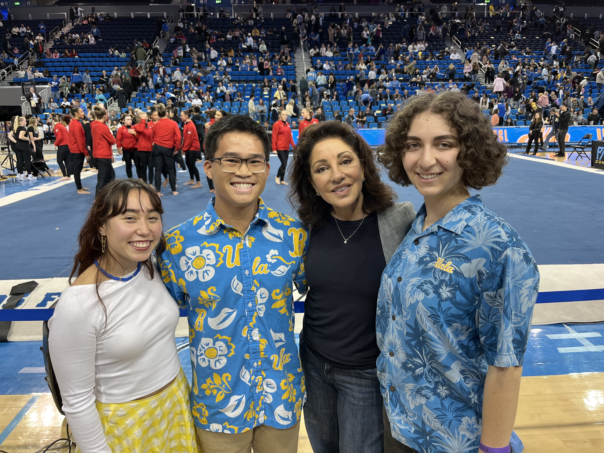
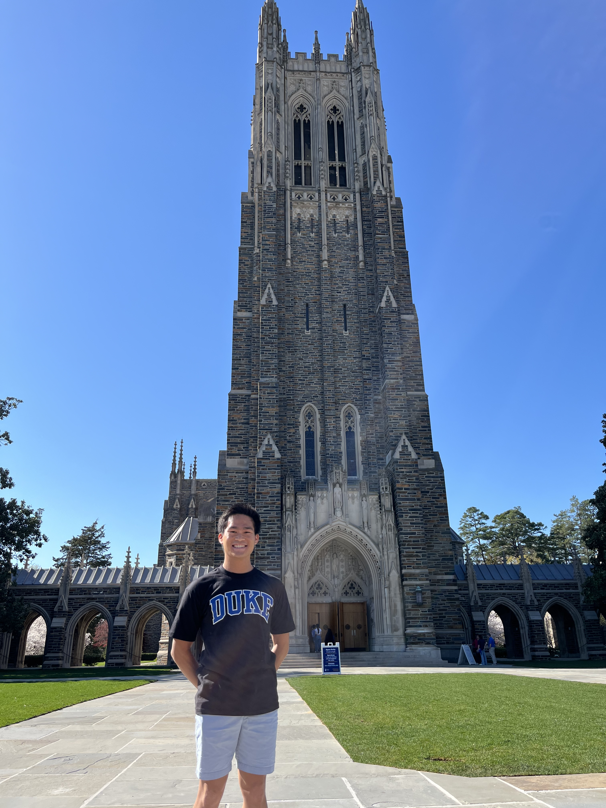
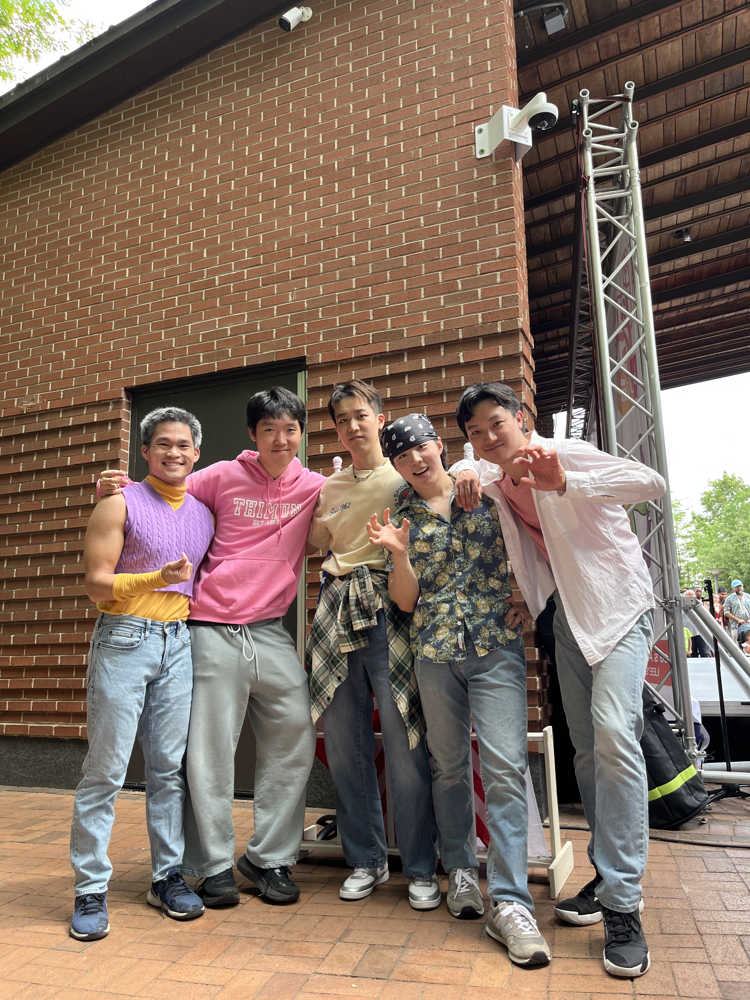

## Welcome!

## Wait but who's speaking to you?

<br>

**Josh Lim** \
josh.lim@duke.edu

<br>

<hr>

<br>

- PhD student in Statistical Science at Duke University
- Research: causal inference, missing data, machine learning, applied medical statistics
- Instructor, STA 199 — Intro to Data Science (Duke)

---

## Where is this?

{width="82%" fig-align="center"}

---

## A bit about me!

- From the San Francisco Bay Area
- Graduated high school in 2020 (cue the I didn't get a prom or graduation jokes)
- Began teaching and tutoring in my junior year of high school!

## Where is this part 2?

{width="90%" fig-align="center"}

## UCLA!

- Attended UCLA from 2020-2024
- Entered as a physics major, switched majors to applied math, added statistics minor, then added a second major in statistics and data science
- Engaged in research and teaching in the stats department
- Felt like there was so much more: wanted to go to graduate school!

{width="90%" fig-align="center"}

---

## Sidequests galore pt 1

{width="90%" fig-align="center"}

## Sidequests galore pt 1

{width="90%" fig-align="center"}

---

## Duke

:::: {.columns}
::: {.column width="50%"}
{width="90%" fig-align="center"}
:::
::: {.column width="50%"}
{width="70%" fig-align="center"}

<br>

- Began my PhD in Statistical Science immediately after graduating UCLA
- Research in causal inference, missing data, and machine learning methodology
- Applied research in health sciences
:::
::::

---

## More sidequests

:::: {.columns}
::: {.column width="50%"}
{width="90%" fig-align="center"}
:::
::: {.column width="50%"}
{width="90%" fig-align="center"}
:::
::::

---

## But Josh, you're a statistician. Why health science? {.smaller}

- Fun fact: I have very life threatening allergies
- As a middle schooler, I enrolled in a clinical trial to help me get rid of some of them (kinda worked)
- After sophomore year of undergraduate, returned to the clinic as a Biostatistician
- Felt like I had found my calling: apply my stats knowledge to help improve the quality of life of patients like me!
- Since then, worked on multiple applied projects at places such as Stanford Medicine, Duke University School of Medicine, and UCSD School of Medicine!
- My ultimate goal: become a professor at a university with a large medical school where I can develop and apply new statistical methods to make tangible changes in people's lives, while teaching curious individuals like you!


## What we will do today!

- Learn basic statistical concepts that cover descriptive and inferential statistics
- Practice with new R commands that allow you to implement the above
- Create a tangible, start-to-finish analysis that uses real-world data

---

## Today's Schedule

**9:30 am – 4:00 pm**

| Time | Block |
|------|-------|
| 9:30 – 10:00 | Module 0 — Welcome & Orientation |
| 10:00 – 11:00 | Module 1 — Data Science Primer |
| 11:00 – 12:00 | Module 2 — Descriptive Statistics |
| 12:15 – 1:00 | Lunch |
| 1:00 – 2:00 | Module 3 — Inferential Statistics |
| 2:00 – 3:00 | Module 4 — Choosing the Right Test |
| 3:00 – 4:00 | Module 5 — Case Study & Wrap-Up |


---

## Motivating Question

### Is smoking really bad for your heart?

. . .

**The claim:** Smokers have higher blood pressure than non-smokers, on average.

. . .

**The problem:** We cannot measure every person on Earth.

**The solution:** Take a carefully designed *sample*, then use *statistics* to reason about the population.

---

## What You Will Do Today

By the end of today, you will be able to:

. . .

- Load a real dataset in R
- Compute summary statistics for smokers vs. non-smokers
- Test whether a blood pressure difference is *statistically meaningful*
- Visualize the result and communicate it clearly

. . .

That is the full data analysis pipeline — we will walk through every step.

---

## The Data Analysis Pipeline

Every health study follows the same basic flow:

. . .

1. **Question** — "Is smoking associated with higher blood pressure?"

. . .

2. **Data Collection** — survey, clinical records, lab measurements

. . .

3. **Analysis** — descriptive stats → visualization → inference

. . .

4. **Interpretation** — what does the result actually mean?

. . .

5. **Communication** — report, paper, policy brief, presentation

---

## What Is R? What Is RStudio?

**R** is a free, open-source language built for statistics and data analysis.

. . .

**RStudio** is the interface you use to write and run R code — not R itself.

. . .

**The four panes of RStudio:**

| Pane | Location | What it does |
|------|----------|--------------|
| **Source** | Top-left | Write and save scripts |
| **Console** | Bottom-left | R runs code and shows output |
| **Environment** | Top-right | Lists objects in memory |
| **Files / Plots / Help** | Bottom-right | Browse files, view plots |

. . .

**Workflow:** Write code in Source → Run (Ctrl/Cmd + Enter) → See results in Console.

---

## Introducing Our Dataset

**NHANES — the National Health and Nutrition Examination Survey**

. . .

- Conducted by the **Centers for Disease Control and Prevention (CDC)**
- Running continuously since 1960
- Combines **interviews** with **physical examinations**
- Designed to represent the **non-institutionalized U.S. civilian population**

. . .

NHANES data track national trends in obesity, diabetes, cardiovascular disease, and nutrition.

. . .

**For today's workshop:** cleaned sample at `data/nhanes_sample.csv` in your workshop folder.

---

## A First Look at the Data

Running `head(nhanes)` in R returns the first 6 rows:

```
  ID Age    Sex             Race  BMI   SBP  DBP Smoker
1  1  34   Male        Hispanic 27.3 118.0 72.0      0
2  2  52 Female           White 31.8 134.5 84.0      1
3  3  28 Female           Black 24.1 112.0 68.5      0
4  4  67   Male           White 29.4 148.0 91.0      1
5  5  45 Female        Hispanic 33.2 126.0 78.5      0
6  6  38   Male Asian/Pacific   22.7 110.5 66.0      0
  Diabetes PhysActive  Chol   Income
```

---

## Variables We Will Use

- `Age`, `BMI`, `SBP`, `DBP`, `Chol` — *continuous*
- `Sex`, `Race`, `Income` — *categorical*
- `Smoker`, `Diabetes`, `PhysActive` — *binary (0 = No, 1 = Yes)*

. . .

**SBP** = systolic blood pressure (mmHg)

**DBP** = diastolic blood pressure (mmHg)

**Chol** = total cholesterol (mg/dL)

---

## Modules

- Each module will have two components
- I will lecture with slides for about half of the time
- Next, I will go through and live code in R that covers the concepts we just learned
- Follow along in your student scripts

---

## BUCKLE UP

- Today will cover A LOT of content
- I don't expect you to master everything immediately
- Rather, follow along and try to absorb as much as possible
- Treat today's workshop materials as a reference for when your own projects!
