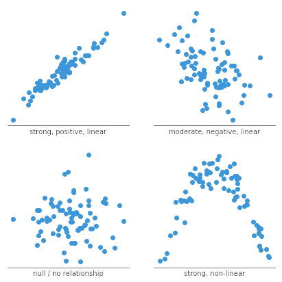

# Part A — What Is a Statistic?

## Population vs. Sample

**We can almost never study everyone.**

. . .

- **Population:** the complete group we care about
  - *Example:* all U.S. adults — over 260 million people
- **Sample:** a subset we actually measure
  - *Example:* ~10,000 NHANES participants

. . .

**Why it matters:** When the CDC reports "average SBP of U.S. adults is 122 mmHg," they measured a sample and estimated a *population parameter*.

---

## Population vs. Sample — Key Takeaway

We will always be working with samples.

. . .

- Statistics gives us tools to be honest about what a sample can tell us
- A sample should be representative of a population
- Entire field of statistics designed for the above (survey design)

. . .

**NHANES** is one of the best-designed health surveys in the world — that is why we use it.

---

## What Is a Statistic?

**A statistic is a single number that summarizes something about a sample.**

. . .

| Statistic | What it captures |
|-----------|-----------------|
| Mean BMI | Typical body mass index in our sample |
| Proportion who smoke | How common smoking is in our sample |
| SD of SBP | How much blood pressure varies across people |
| Correlation of BMI and cholesterol | Whether heavier people tend to have higher cholesterol |

. . .

**The goal of descriptive statistics:** reduce hundreds of rows and columns down to a small set of numbers and graphics.

---

# Part B — Center

## The Mean - Concept

**The mean is the arithmetic average — the "balance point" of a distribution.**

$$\bar{x} = \frac{x_1 + x_2 + \cdots + x_n}{n} = \frac{\sum_{i=1}^{n} x_i}{n}$$

. . .

- Sum all values, divide by the count
- Sensitive to extreme outliers

---

## The Mean — In R

```{r}
#| echo: true
nhanes <- read.csv("../../data/nhanes_sample.csv")

# mean() computes the arithmetic average
mean(nhanes$BMI)
```

. . .

- Mean BMI ≈ 28.4 kg/m²

---

## The Median — Concept

**The median is the middle value when all observations are sorted.**

. . .

- Sort 100 BMI values from smallest to largest
- Median = average of positions 50 and 51
- Exactly half of values fall below; half above

. . .

**Key property:** The median is *resistant to outliers*. A BMI of 85 barely moves the median but can pull the mean up noticeably.

---

## The Median — In R

```{r}
#| echo: true
# median() finds the middle value — ignores extreme outliers
median(nhanes$BMI)

# Compare to the mean:
mean(nhanes$BMI)
```

. . .

**When to use median over mean:** Skewed health variables — hospital costs, wait times, income, extreme lab values.

---

## Mean vs. Median — When Does It Matter?

**When data are symmetric, mean ≈ median. When skewed, they can be very different.**

. . .

```{r}
#| echo: true
#| fig-height: 5
#| fig-width: 9
#| output-location: column-fragment
# Histogram of SBP — is it symmetric or skewed?
hist(nhanes$SBP,
     main  = "Distribution of Systolic Blood Pressure",
     xlab  = "SBP (mmHg)",
     col   = "steelblue",
     breaks = 20)

# Add vertical lines for mean (red) and median (darkgreen)
abline(v = mean(nhanes$SBP), col = "red",       lwd = 2)
abline(v = median(nhanes$SBP), col = "darkgreen", lwd = 2)
```

---

## Skewed Distributions — A Health Example

**Hospital length-of-stay is classic right-skewed health data.**

. . .

```{r}
#| echo: true
#| fig-height: 5
#| fig-width: 9
#| output-location: column-fragment
# Simulate a right-skewed length-of-stay variable
set.seed(42)
los <- round(rexp(400, rate = 0.2) + 1)  # days in hospital

hist(los,
     breaks = 30,
     col    = "salmon",
     border = "white",
     main   = "Simulated Hospital Length of Stay",
     xlab   = "Days",
     ylab   = "Number of Patients")

abline(v = mean(los),   col = "red",        lwd = 2)
abline(v = median(los), col = "darkgreen",  lwd = 2)
legend("topright",
       legend = c(paste("Mean =",   round(mean(los),   1)),
                  paste("Median =", round(median(los), 1))),
       col = c("red", "darkgreen"), lwd = 2)
```

---

## Mean vs. Median — Takeaway

**Skewed health distributions are common:**

. . .

- Income, hospital charges, length of stay
- Lab values with extreme high values

. . .

**Rule:** Always plot before choosing a summary statistic.

---

# Part C — Spread

## Why Spread Matters

**The mean alone can be dangerously misleading.**

. . .

Two patients, both with mean blood pressure of 120 mmHg over 10 readings:

. . .

- **Patient A:** 119, 120, 120, 121, 120, 119, 121, 120, 120, 120 — very stable
- **Patient B:** 98, 142, 105, 138, 110, 135, 107, 140, 112, 133 — wildly variable

. . .

Same mean. Very different clinical picture.

---

## Why Spread Matters — Takeaway

**Spread matters just as much as center.**

. . .

Patient B's variability might indicate:

- White-coat hypertension
- Measurement error
- An underlying condition needing investigation

. . .

Measures of spread we will cover:

- Standard deviation and variance
- Interquartile range (IQR)
- Range and five-number summary

---

## Variance and Standard Deviation — Concept

**Standard deviation (SD) is the average distance from the mean.**

$$s = \sqrt{\frac{\sum_{i=1}^{n}(x_i - \bar{x})^2}{n - 1}}$$

. . .

- Square each deviation (makes negatives positive)
- Average those squared deviations = **variance**
- Take the square root → back to original units = **SD**

---

## Variance and Standard Deviation — In R

```{r}
#| echo: true
# var() computes variance (squared units — harder to interpret)
var(nhanes$BMI)

# sd() is the square root of variance (same units as BMI)
sd(nhanes$BMI)
```

. . .


---

## IQR and Range — Concept

**IQR and range describe spread without relying on the mean.**

. . .

- **Range:** distance from minimum to maximum — sensitive to outliers
- **IQR:** distance from 25th to 75th percentile — resistant to outliers

. . .

**Clinical relevance:** Blood pressure guidelines use percentile cutoffs (e.g., "below the 90th percentile for age") because BP is not perfectly normal.

---

## IQR and Range — In R

```{r}
#| echo: true
# range() returns the minimum and maximum
range(nhanes$SBP)

# IQR() returns the middle 50% of the data
IQR(nhanes$SBP)

# quantile() lets you request any percentile
quantile(nhanes$SBP, probs = c(0.25, 0.75))
```

---

## The Five-Number Summary — Concept

**Five numbers that together describe any numeric variable.**

. . .

| Number | What it is |
|--------|-----------|
| **Min** | Lowest observed value |
| **Q1** | 25th percentile |
| **Median** | 50th percentile |
| **Q3** | 75th percentile |
| **Max** | Highest observed value |

. . .

The five-number summary is the foundation of the **boxplot**.

---

## The Five-Number Summary — In R

```{r}
#| echo: true
# summary() on a numeric column returns the five-number summary + mean
summary(nhanes$SBP)
```

. . .

- `summary()` gives all five numbers plus the mean in one call
- Use this as a quick first look at any numeric variable

---

# Part D — Data Types

## Data Types Overview

**The right statistical summary depends on the type of variable.**

. . .

**Categorical variables** — values are names or labels

- *Nominal:* no natural order — `Sex`, `Race`, `Income` categories (I typically refer to this as just categorical variables)
- *Ordinal:* ordered categories — pain scale (1–5), satisfaction (Low/Med/High)

. . .

**Numeric variables** — values can be compared mathematically

- *Continuous:* any value in a range — `BMI`, `SBP`, `Chol`
- *Discrete:* whole numbers only — count of hospitalizations

---

## Data Types in NHANES

**In our NHANES dataset:**

| Variable | Type |
|----------|------|
| `Age`, `BMI`, `SBP`, `DBP`, `Chol` | Continuous numeric |
| `Smoker`, `Diabetes`, `PhysActive` | Binary (0/1) |
| `Sex`, `Race`, `Income` | Categorical (nominal) |

. . .

Identifying variable type is the first step before any analysis.

---

## Binary Variables — Concept

**Binary variables take exactly two values, coded 0 and 1.**

. . .

- `Smoker`: 0 = never/former smoker, 1 = current smoker
- `Diabetes`: 0 = no diagnosis, 1 = diabetes
- `PhysActive`: 0 = not physically active, 1 = physically active
- In clinical trials or randomized experiments: 0 = treatment, 1 = control/placebo

. . .


**Mathematical convenience:** The *mean* of a binary variable equals the *proportion* of 1s.

---

## Binary Variables — In R

```{r}
#| echo: true
# Count how many smokers and non-smokers are in the sample
table(nhanes$Smoker)

# Proportions: divide by total number of observations
prop.table(table(nhanes$Smoker))
```

. . .

- `mean(nhanes$Smoker)` gives the proportion who smoke
- Counts and proportions are both informative — report both

---

## Choosing the Right Summary Statistic {.smaller}

**Variable type determines which summaries are meaningful.**

| Variable type | Center | Spread | Best plot |
|---------------|--------|--------|-----------|
| Continuous, symmetric | Mean | SD | Histogram, boxplot |
| Continuous, skewed | Median | IQR | Histogram, boxplot |
| Binary (0/1) | Proportion | — | Bar chart |
| Nominal categorical | Frequency / % | — | Bar chart |
| Ordinal categorical | Median | IQR | Bar chart |

. . .

**Common mistake:** Reporting mean ± SD for a skewed variable can produce a "normal range" that includes negative values.

---

# Part E — Bivariate Data and Intro to Regression

## What Is a Relationship?

**So far we have summarized one variable at a time. Now: do two variables move together?**

. . .

**Health question:** Do people with higher BMI tend to have higher systolic blood pressure?

. . .

**What patterns to look for in a scatter plot:**

- Trend (Positive or Negative)
- Shape (Linear or non linear)
- Strength (Weak, moderate, strong)

---

## Examples

{width="82%" fig-align="center"}

## Scatter Plot — BMI vs. SBP

```{r}
#| echo: true
#| fig-height: 5
#| fig-width: 9
#| output-location: column-fragment
# plot() creates a scatter plot of two continuous variables
plot(nhanes$BMI, nhanes$SBP,
     xlab = "BMI",
     ylab = "Systolic Blood Pressure (mmHg)",
     main = "BMI vs. Systolic Blood Pressure",
     pch  = 16,
     col  = "steelblue",
     cex  = 0.6)
```

---

## Correlation — Concept

**Correlation measures the strength and direction of a linear relationship.**

The Pearson correlation coefficient $r$:

. . .

- Ranges from **-1** (perfect negative) to **+1** (perfect positive)
- **0** means no linear relationship
- Sign = direction; magnitude = strength

. . .

**Critical warning:** Correlation does not imply causation.

---

## Correlation — In R

```{r}
#| echo: true
# cor() computes Pearson correlation
cor(nhanes$BMI, nhanes$SBP)
```

---

## Simple Linear Regression — Concept

**Regression goes further than correlation — it gives a prediction equation.**

The simple linear regression model:

$$\text{SBP} = \beta_0 + \beta_1 \times \text{BMI} + \varepsilon$$

. . .

- $\beta_0$ = **intercept** — predicted SBP when BMI = 0
- $\beta_1$ = **slope** — SBP increase per 1-unit increase in BMI
- $\varepsilon$ = **error** — what the line cannot explain

---

## Simple Linear Regression — In R

```{r}
#| echo: true
# lm() fits a linear model
# formula: outcome ~ predictor
fit <- lm(SBP ~ BMI, data = nhanes)
summary(fit)
```

---

## Interpreting Slope and Intercept

From `summary(fit)` — look at the `Coefficients` table:

```
Coefficients:
            Estimate Std. Error t value Pr(>|t|)
(Intercept)   91.43       3.21   28.49   <2e-16 ***
BMI            1.14       0.11   10.37   <2e-16 ***
```

. . .

- **Intercept (91.43):** Predicted SBP when BMI = 0
- **Slope (1.14):** Each +1 BMI unit predicts +1.14 mmHg SBP, on average

. . .

**Plain English:** A person with BMI 30 is predicted to have SBP about 11 mmHg higher than a person with BMI 20.

**Caution:** This is an *association*, not proof of causation.

---

# Part F — Appropriate Graphics

## Histogram

**Histograms show the distribution of a single continuous variable.**

. . .

**What to look for:** Shape (symmetric? skewed?), center, spread, unusual gaps or spikes.

---

## Histogram — In R

```{r}
#| echo: true
#| fig-height: 5
#| fig-width: 9
#| output-location: column-fragment
hist(nhanes$BMI,
     breaks = 25,
     col    = "steelblue",
     border = "white",
     main   = "Distribution of BMI in NHANES Sample",
     xlab   = "BMI (kg/m²)",
     ylab   = "Number of Participants")

# Add a vertical line at the WHO obesity cutoff (BMI = 30)
abline(v = 30, col = "red", lwd = 2, lty = 2)
```

---

## Boxplot

**Boxplots display the five-number summary and highlight outliers.**

. . .

**Especially useful for comparing groups.**

Reading a boxplot:

- Box = IQR (middle 50%)
- Line inside box = median
- Whiskers = extend to ~1.5 × IQR
- Dots beyond whiskers = potential outliers

---

## Boxplot — In R

```{r}
#| echo: true
#| fig-height: 5
#| fig-width: 9
#| output-location: column-fragment
boxplot(nhanes$SBP,
        col  = "lightblue",
        main = "Distribution of Systolic Blood Pressure",
        ylab = "SBP (mmHg)")
```

---

## Boxplot — Comparing Groups

```{r}
#| echo: true
#| fig-height: 5
#| fig-width: 9
#| output-location: column-fragment
boxplot(SBP ~ Smoker,
        data  = nhanes,
        col   = c("lightblue", "salmon"),
        names = c("Non-Smoker", "Smoker"),
        main  = "Systolic BP by Smoking Status",
        ylab  = "SBP (mmHg)",
        xlab  = "Smoking Status")
```

---

## Scatter Plot with Regression Line

**Scatter plots reveal relationships between two continuous variables.**

. . .

**Use a scatter plot when:** Both variables are continuous and you want to describe or model their relationship.

---

## Scatter Plot — In R

```{r}
#| echo: true
#| fig-height: 5
#| fig-width: 9
#| output-location: column-fragment
plot(nhanes$BMI, nhanes$SBP,
     xlab = "BMI (kg/m²)",
     ylab = "Systolic Blood Pressure (mmHg)",
     main = "BMI vs. Systolic Blood Pressure",
     pch  = 16,
     col  = adjustcolor("steelblue", alpha.f = 0.4),
     cex  = 0.7)

# abline() adds the regression line from the lm() model
fit <- lm(SBP ~ BMI, data = nhanes)
abline(fit, col = "red", lwd = 2)
```

---

## Bar Chart

**Bar charts display counts or proportions for categorical variables.**

. . .

**Note:** Bar charts are for *categories*, not for continuous data. A common error is using a bar chart where a histogram is appropriate.

---

## Bar Chart — In R

```{r}
#| echo: true
#| fig-height: 5
#| fig-width: 9
#| output-location: column-fragment
race_counts <- table(nhanes$Race)

barplot(race_counts,
        col   = "steelblue",
        main  = "Sample Composition by Race/Ethnicity",
        ylab  = "Number of Participants",
        xlab  = "Race/Ethnicity",
        las   = 2,
        ylim  = c(0, max(race_counts) * 1.2))
```

---

## Which Plot Should I Use? {.smaller}

**Matching your variable type to the right graphic.**

| Situation | Recommended plot |
|-----------|-----------------|
| One continuous variable — see distribution | **Histogram** |
| One continuous variable — see outliers / five-number summary | **Boxplot** |
| One categorical variable — see frequencies | **Bar chart** |
| Two continuous variables — see relationship | **Scatter plot** |
| One continuous variable across groups | **Side-by-side boxplots** |
| Two categorical variables — see association | **Grouped bar chart** |

. . .

---

## Module 2 — R Function Reference {.smaller}

::: {style="font-size: 0.65em"}
| Function | What it does |
|----------|-------------|
| `read.csv()` | Load a CSV file into a data frame |
| `head()`, `str()`, `dim()` | Inspect a data frame |
| `mean()`, `median()` | Center: arithmetic average and middle value |
| `sd()`, `var()` | Spread: standard deviation and variance |
| `IQR()`, `range()` | Spread: interquartile range and min/max |
| `quantile()` | Any percentile(s) of a numeric variable |
| `summary()` | Five-number summary + mean for every column |
| `table()`, `prop.table()` | Counts and proportions for categorical/binary variables |
| `cor()` | Pearson correlation between two numeric variables |
| `lm()` | Fit a linear regression model |
| `hist()` | Histogram of a continuous variable |
| `boxplot()` | Boxplot — one variable or grouped by a factor |
| `plot()` | Scatter plot of two continuous variables |
| `barplot()` | Bar chart for categorical counts |
| `abline()` | Add reference lines or a regression line to a plot |
:::
