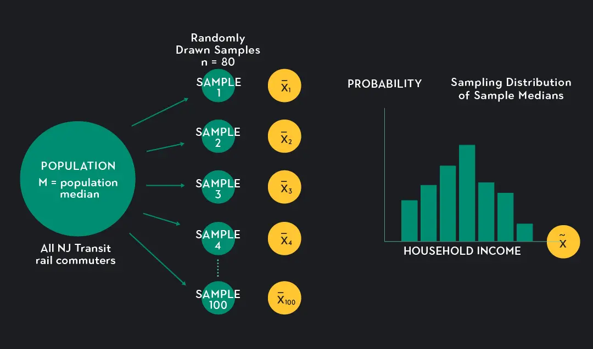

```{r}
#| echo: false
# Load data once at the top; all subsequent slides can use nhanes
nhanes <- read.csv("../../data/nhanes_sample.csv", header = TRUE,
                   stringsAsFactors = FALSE)
# Create hypertensive variable used in later slides
nhanes$hypertensive <- ifelse(nhanes$SBP >= 140, 1, 0)
```

# Part A — Why Inference?

## The Core Problem: Sample vs. Population

We almost never have data on **everyone**. We have a **sample**.

. . .

**Descriptive statistics** summarize our sample:

> "In our 500 NHANES participants, mean SBP = 121 mmHg"

. . .

**Inferential statistics** make claims about the population:

> "We estimate the mean SBP of US adults is between 118 and 124 mmHg"

---

## Why We Need Inference

The key question: How much should we trust our sample estimate?

. . .

- Our sample is one of many possible samples
- A different sample would give a different mean
- Inference quantifies how much our estimate might be off

. . .

This is what inferential statistics is for.

---

## Sampling Variability: The Fundamental Problem

If we drew a different sample, we'd get a different mean.

```{r}
#| echo: true
# Draw 5 random samples of 30 participants; compute mean SBP each time
replicate(5, mean(sample(nhanes$SBP, 30, replace = TRUE)))
```

. . .

Every run gives a **different answer** — the population hasn't changed.

. . .

**Sampling variability** is why we can't just report a mean and stop. We need tools to quantify uncertainty.

# Part B — Sampling Distributions

## What Is a Sampling Distribution?

Imagine drawing thousands of samples, computing the mean SBP from each.

The **distribution of those means** = the **sampling distribution**.

. . .

It answers: *How much would my estimate bounce around if I repeated the study?*

. . .

- Each sample gives one estimate (one dot)
- The sampling distribution = spread of all those estimates
- We never observe it directly — but we can **simulate** it

---

## Picture

{width="85%" fig-align="center"}

## The Central Limit Theorem (CLT)

**One of the most important results in all of statistics:**

> Regardless of the original distribution's shape, the sampling distribution of the mean approaches **normal** as sample size grows.

. . .

- Applies even when raw data are skewed
- Works for means, proportions, and many other statistics
- Justifies using normal-based methods (t-tests, CIs)

---

## Simulating the CLT

```{r}
#| echo: true
#| fig-height: 5
#| fig-width: 9
#| output-location: column-fragment
# Draw 1000 samples of size 30; store mean SBP from each
set.seed(42)
sample_means <- replicate(1000,
                  mean(sample(nhanes$SBP, 30, replace = TRUE)))

hist(sample_means, breaks = 30, col = "steelblue",
     main = "Sampling Distribution of Mean SBP (n=30)",
     xlab = "Sample Mean SBP (mmHg)")
```

---

## Standard Error: Measuring Sampling Variability

The **Standard Error (SE)** = standard deviation of the sampling distribution.

It quantifies how precise our estimate is.

For a single, continuous variable mean:

. . .

$$SE = \frac{SD}{\sqrt{n}}$$

. . .

- Other formulas for different problems

---

## Calculating SE in R

```{r}
#| echo: true
# Manual SE calculation for mean SBP
n      <- nrow(nhanes)
sd_sbp <- sd(nhanes$SBP)
SE     <- sd_sbp / sqrt(n)
SE
```

# Part C — Confidence Intervals

## What Is a Confidence Interval?

A **confidence interval (CI)** gives a range of plausible values for the true population parameter.

. . .

**The fishing net analogy:**

- The true mean is a fish in the ocean (we can't see it)
- Each study casts a net (the CI)
- A 95% CI: if we cast 100 nets, **95 will catch the fish**

. . .

**It does NOT mean:** "95% probability the true value is in this interval." The true value is fixed — not random.

---

## Constructing a 95% CI

$$\bar{x} \pm 1.96 \times SE$$

```{r}
#| echo: true
# Step 1: calculate the components
x_bar <- mean(nhanes$SBP)
SE    <- sd(nhanes$SBP) / sqrt(nrow(nhanes))

# Step 2: construct the interval manually
lower <- x_bar - 1.96 * SE
upper <- x_bar + 1.96 * SE
c(lower, upper)
```

---

## CI in R: Using `t.test()`

```{r}
#| echo: true
# t.test() gives the exact CI (uses t-distribution, not 1.96)
# For large samples, results are nearly identical to manual
t.test(nhanes$SBP)$conf.int
```

. . .

- The t-distribution accounts for uncertainty in estimating SD
- With large n, t-distribution ≈ normal distribution

---

## Interpreting Confidence Intervals

```{r}
#| echo: false
ci <- t.test(nhanes$SBP)$conf.int
```

> Mean SBP = `r round(mean(nhanes$SBP), 1)` mmHg
> 95% CI: (`r round(ci[1], 1)`, `r round(ci[2], 1)`) mmHg

. . .

**Correct interpretation:**
"We are 95% confident the true mean SBP in the population lies between [lower] and [upper] mmHg."

. . .

**Common misconceptions:**

| Misconception | Why it's wrong |
|--------------|----------------|
| "95% prob. true mean is in this interval" | True mean is fixed, not random |
| "95% of individuals fall in this range" | That's a prediction interval |

---

## Visualizing CIs: Smokers vs. Non-Smokers

```{r}
#| echo: true
#| fig-height: 5
#| fig-width: 9
#| output-location: column-fragment
ci0 <- t.test(nhanes$SBP[nhanes$Smoker == 0])$conf.int
ci1 <- t.test(nhanes$SBP[nhanes$Smoker == 1])$conf.int
m0  <- mean(nhanes$SBP[nhanes$Smoker == 0])
m1  <- mean(nhanes$SBP[nhanes$Smoker == 1])

# set y-axis range from the actual CI bounds so nothing gets clipped
ylim_range <- c(min(ci0[1], ci1[1]) - 2, max(ci0[2], ci1[2]) + 2)

plot(c(1, 2), c(m0, m1),
     xlim = c(0.5, 2.5), ylim = ylim_range,
     xaxt = "n", pch = 16, cex = 2,
     col  = c("steelblue", "salmon"),
     main = "Mean SBP with 95% CI",
     ylab = "SBP (mmHg)", xlab = "")
axis(1, at = c(1, 2), labels = c("Non-Smoker", "Smoker"))
arrows(x0 = 1, y0 = ci0[1], y1 = ci0[2],
       code = 3, angle = 90, length = 0.08, lwd = 2, col = "steelblue")
arrows(x0 = 2, y0 = ci1[1], y1 = ci1[2],
       code = 3, angle = 90, length = 0.08, lwd = 2, col = "salmon")
```

---

## Wider vs. Narrower CIs

What makes a CI wider or narrower?

```{r}
#| echo: true
# SE shrinks as n grows
ns  <- c(10, 30, 100, 500)
SEs <- sapply(ns, function(n) sd(nhanes$SBP) / sqrt(n))
data.frame(n = ns, SE = round(SEs, 2), CI_width = round(2 * 1.96 * SEs, 2))
```

. . .

- Larger n → smaller SE → narrower CI → more precise estimate
- More variability in data → wider CI (honest about uncertainty)

# Part D — Hypothesis Testing

## The Logic of Hypothesis Testing

**The core idea:**

1. Assume **nothing interesting is happening** (H₀, the null hypothesis)
2. Collect data
3. Ask: *How surprising would our data be if H₀ were true?*
4. If sufficiently surprising → reject H₀

. . .

**Analogy:** A criminal trial
- H₀ = "the defendant is innocent"
- "Beyond a reasonable doubt" = data too unlikely under H₀

---

## Null and Alternative Hypotheses

**Research question:** Do smokers and non-smokers differ in mean SBP?

. . .

$$H_0: \mu_{smoker} = \mu_{non-smoker}$$
$$H_1: \mu_{smoker} \neq \mu_{non-smoker}$$

. . .

- H₀: "Smoking has no relationship with SBP in the population"
- H₁: "Smoking is associated with a different mean SBP"
- H₁ here is **two-sided** (difference in either direction counts)

---

## The p-value

The **p-value** = probability of observing data *as extreme as ours*, **assuming H₀ is true**.

```{r}
#| echo: true
# t.test() compares means between two groups
result <- t.test(SBP ~ Smoker, data = nhanes)
result
```

---

## Interpreting the p-value

```{r}
#| echo: false
pval <- t.test(SBP ~ Smoker, data = nhanes)$p.value
```

> p = `r round(pval, 3)`: probability of seeing this large a difference by chance if H₀ were true.

. . .

**What the p-value is NOT:**

| Statement | Correct? |
|-----------|---------|
| "Probability H₀ is true" | No |
| "Probability result is due to chance" | No |
| "Effect size or clinical importance" | No |

. . .

A p-value tells you about **surprise** under H₀ — nothing more.

---

## The α Threshold

We set a significance level **α** before the test.

. . .

**Convention in health science:** α = 0.05

- p < 0.05 → "statistically significant" — reject H₀
- p ≥ 0.05 → "not statistically significant" — fail to reject H₀

---

## Testing Against α in R

```{r}
#| echo: true
alpha   <- 0.05
p_value <- t.test(SBP ~ Smoker, data = nhanes)$p.value
p_value < alpha   # TRUE = significant; FALSE = not significant
```

. . .

**Important:** α = 0.05 is a **convention**, not a law of nature.
Some fields use α = 0.01 (more conservative) or α = 0.10 (more lenient).

---

# Part E — Odds Ratios and 2×2 Tables

## Risk vs. Odds

Two ways to quantify how common an outcome is.

**Scenario:** 20 out of 100 patients develop hypertension.

. . .

$$\text{Risk} = \frac{20}{100} = 0.20 \qquad \text{Odds} = \frac{20}{80} = 0.25$$

. . .

- Risk uses total n in the denominator; odds uses non-events
- Odds used in **logistic regression** and **case-control studies**
- For rare outcomes (< 10%), odds ≈ risk

---

## The 2×2 Table

The foundation of association analysis in epidemiology:

|  | **Outcome: Yes** | **Outcome: No** | **Total** |
|--|------------------|-----------------|-----------|
| **Exposed: Yes** | a | b | a+b |
| **Exposed: No**  | c | d | c+d |
| **Total** | a+c | b+d | n |

. . .

**Our example:** Smoking (exposure) × Hypertension (outcome)

---

## Building the 2×2 Table in R

```{r}
#| echo: true
# Build the 2x2 table: rows = Smoker, columns = hypertensive
tab <- table(Smoker = nhanes$Smoker,
             Hypertensive = nhanes$hypertensive)
tab
```

---

## The Odds Ratio Formula

The **Odds Ratio (OR)** compares odds of the outcome between exposed and unexposed.

$$OR = \frac{a \times d}{b \times c}$$

- OR > 1: exposure linked to **higher odds** of outcome
- OR = 1: **no association**
- OR < 1: exposure linked to **lower odds** (protective)

---

## Calculating the OR: `fisher.test()`

```{r}
#| echo: true
# fisher.test() returns the OR, 95% CI, and p-value in one call
fisher.test(tab)
```

---

## Interpreting the Output

```{r}
#| echo: false
ft <- fisher.test(tab)
```

**OR = `r round(ft$estimate, 2)`**
**95% CI: (`r round(ft$conf.int[1], 2)`, `r round(ft$conf.int[2], 2)`)**
**p = `r round(ft$p.value, 3)`**

. . .

> Smokers have `r round(ft$estimate, 2)`× the odds of hypertension compared to non-smokers.

. . .

**Rule:** An OR whose CI includes 1.0 is **not statistically significant** at α = 0.05.

---

## Why the CI Around an OR Matters

An OR of 2.5 could mean very different things:

| OR | 95% CI | Interpretation |
|----|--------|---------------|
| 2.5 | (2.1, 3.0) | Strong, precisely estimated effect |
| 2.5 | (0.9, 6.8) | Uncertain — CI crosses 1 |
| 2.5 | (1.2, 5.2) | Elevated odds, but wide |

. . .

**Rule:** An OR whose CI includes 1.0 is **not statistically significant** at α = 0.05.

---

## Fisher's Exact vs. Chi-Square

Both test association in a 2×2 table — they answer the same question but differently.

. . .

| | `fisher.test()` | `chisq.test()` |
|---|---|---|
| Method | Exact (hypergeometric) | Approximation |
| Returns OR + CI | Yes | No — p-value only |
| Best when | Any sample size | Large samples (all cells ≥ 5) |
| p-value | Exact | Approximate |

. . .

**Rule of thumb:** Most people use `chisq.test()` to check for association test and don't need the OR. In small samples, user fisher. 